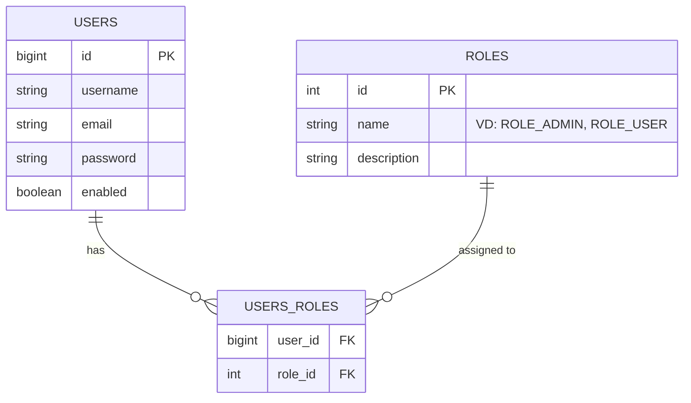

# Thiết kế Database PostgreSQL với RBAC (Role-Based Access Control)

Hiện tại, hệ thống đang sử dụng một trường `roles` đơn giản (String) trong bảng `users`. Để chuyển sang mô hình RBAC chuẩn, chúng ta cần tách Roles ra thành một bảng riêng và tạo quan hệ Many-to-Many với Users.

## 1. Sơ đồ ERD (Entity Relationship Diagram)



## 2. Script SQL (PostgreSQL)

```sql
-- 1. Tạo bảng Roles
CREATE TABLE roles (
    id SERIAL PRIMARY KEY,
    name VARCHAR(50) NOT NULL UNIQUE,
    description VARCHAR(255)
);

-- 2. Tạo bảng Users (Nếu chưa có, hoặc cập nhật bảng cũ)
-- (Giả sử bảng users đã có các cột cơ bản username, email, password)

-- 3. Tạo bảng trung gian Users_Roles
CREATE TABLE users_roles (
    user_id BIGINT NOT NULL,
    role_id INTEGER NOT NULL,
    PRIMARY KEY (user_id, role_id),
    CONSTRAINT fk_user FOREIGN KEY (user_id) REFERENCES users(id) ON DELETE CASCADE,
    CONSTRAINT fk_role FOREIGN KEY (role_id) REFERENCES roles(id) ON DELETE CASCADE
);

-- 4. Dữ liệu mẫu (Data Seeding)
INSERT INTO roles (name, description) VALUES 
('ROLE_USER', 'Người dùng cơ bản'),
('ROLE_ADMIN', 'Quản trị viên hệ thống'),
('ROLE_MODERATOR', 'Người kiểm duyệt nội dung');
```

## 3. Cấu trúc Java Entity (JPA)

### User Entity (`User.java`)
Cần cập nhật để sử dụng `@ManyToMany`.

```java
@Entity
@Table(name = "users")
public class User {
    // ... các field khác (id, username, email...)

    @ManyToMany(fetch = FetchType.EAGER)
    @JoinTable(
        name = "users_roles",
        joinColumns = @JoinColumn(name = "user_id"),
        inverseJoinColumns = @JoinColumn(name = "role_id")
    )
    private Set<Role> roles = new HashSet<>();

    // Getters, Setters & Helper methods
    public void addRole(Role role) {
        this.roles.add(role);
    }
}
```

### Role Entity (`Role.java`)
Tạo mới class này.

```java
@Entity
@Table(name = "roles")
public class Role {
    @Id
    @GeneratedValue(strategy = GenerationType.IDENTITY)
    private Integer id;

    @Column(nullable = false, unique = true)
    private String name;

    private String description;

    // Constructors, Getters, Setters
}
```

### Enum Role (Optional)
Để tránh hardcode string ("ROLE_USER"), nên tạo Enum.

```java
public enum ERole {
    ROLE_USER,
    ROLE_MODERATOR,
    ROLE_ADMIN
}
```

## 4. Các bước cần thực hiện để nâng cấp
1.  Tạo Entity `Role`.
2.  Cập nhật Entity `User` (thay `String roles` thành `Set<Role> roles`).
3.  Tạo `RoleRepository`.
4.  Cập nhật logic `AuthService` (khi đăng ký user mới, phải fetch Role từ DB để gán).
5.  Cập nhật logic `CustomOAuth2UserService` (tương tự như AuthService).
6.  Cập nhật `JwtUtil`/`JwtAuthFilter` để đọc roles từ Set thay vì String.
7.  Cập nhật `DataSeeder` để tạo Roles mẫu trước khi tạo Admin user.
